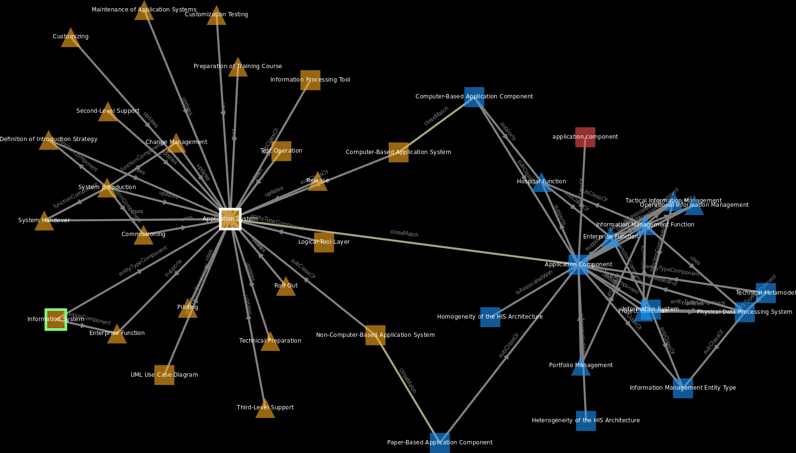

# Summary
Medical and health informatics integrates knowledge of business information systems, computer science and medicine.
As a comparatively young research discipline, it lacks a uniform terminology, especially for describing health information systems and their management.
Several textbooks provide different perspectives of the discipline but the linear struture inherent in a book does not intuitively convey the highly connected nature of the concepts of the domain.
SNIK [@sniktec] is a semantic network of information management in hospitals, which uses Semantic Web standards like RDF and OWL to model and publish the knowledge of three textbooks [@bb; @ob; @he], the IT4IT [@it4it] standard and an interview with a hospital CIO.
Each of those sources is modelled according to the SNIK meta model,  which classifies each resource as being either a role, function or entity type, see \autoref{fig:metamodel}.

{ width=95% }

SNIK Graph is a web-based interactive Linked Data graph visualization of SNIK, which is based on Cytoscape.js [@cytoscapejs], a JavaScript graph visualization and analysis library.
An installation visualizing SNIK is published at <https://www.snik.eu/graph> and <https://snikproject.github.io/graph>, but other ontologies and knowledge bases can be used as well.
Due to the large amount of resources, visualizing SNIK as a graph causes overplotting as shown in \autoref{fig:completegraph}.
SNIK Graph offers several options to select and layout subgraphs in multiple views [@thomasba], for example to show only a specific chapter of a book to prepare a lecture about a specific topic.

A frequent question is, what a given role does and which information is needed for those functions represented by the entity types connected to those functions.
This question is visually answered by the *class use* feature, which arranges roles, functions and entity types in concentric circles, see \autoref{fig:roleuse}.

{ width=94% }

Users can also iteratively explore SNIK starting at a single class using neighbourhood and path operations.
Exploration using neighbours, that is the successive uncovering of nodes adjacent to a starting node given by a user, is a common feature of tools such as LodLive [@lodlive] and VizLOD [@vizlod].
The directed and undirected *star* operations show nodes in the direct neighbourhood of selected nodes.
The *circle star* also rearranges the nodes using the force-directed layout locally on the currently visible subgraph.
\autoref{fig:star} shows a mind map of a topic, created by an undirected star, which can be used by a teacher to prepare a lecture about that topic.

{ width=70% }

A *spiderworm* is a path from node A to node B combined with a *star* of B.
\autoref{fig:spiderworm} shows how we use a spiderworm to teach a student how the new concept "quality of data" is connected the already introduced concept "patient identification number."

{ width=100% }

# Statement of need
While students can access this knowledge in a structured way using SNIK, this requires knowledge of Semantic Web technologies like SPARQL queries.
The main goal of SNIK Graph is to visualize SNIK to users that may not have any Semantic Web experience.
Graph-based visualizations allow teachers to intuitively convey relationships between a selection of those concepts and also allow students to explore the domain on their own [@ontologybased].
There are several existing graph-based Linked Data visualizations [@linkeddatavisualization], which visualize RDF resources (classes or instances) as nodes and their relationships as edges, but they do not fit our requirements [@visualizationoflargeontologies].

# Future work
The single-thread paradigm of JavaScript seriously hinders performance of CPU-bound applications like SNIK Graph on the more than 4000 resources of SNIK.
While SNIK Graph does not require perfectly smooth motion, and wild movements are not a common usage pattern, stuttering is still frustrating to users especially on less performant CPUs and browsers other than Chrome, which is contrary to our goal of minimizing friction for users. 
Implementing an OpenGL-based renderer for Cytoscape.js may dramatically increase render speed.

The search index is implemented using the Fuse.js [@fuse] client-side library based on the Baeza-Yates--Gonnet algorithm [@textsearching].
This enables fuzzy search on any dataset loaded via SPARQL endpoint without needing a backend search index like Elasticsearch but requires waiting for index initialization on the first search of each user session and is not fast enough for autocompletion, even with debouncing and throttling.
Adding a separate search backend will provide much faster initialization and search.

# Acknowledgements
SNIK is supported by the DFG (German Research Foundation), grant 1605/7-1 and 1387/8-1.
We are especially thankful to Anna Brakemeier for her insightful suggestions for improving SNIK Graph, which she presented in her Bachelor's thesis.

# References
